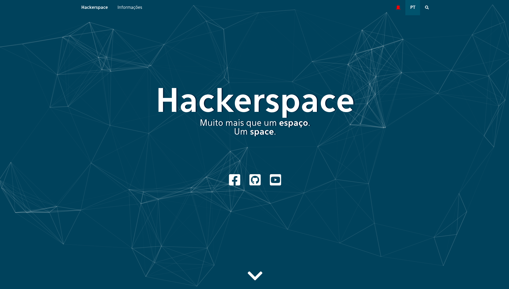

# Hackerspace IFUSP - Webpage




O Hackerspace IFUSP é um espaço físico mantido e operado pela comunidade que o frequenta, onde pessoas compartilham seus interesses e projetos relacionados à tecnologia e aprendem com o trabalho dos outros.

Este repositório contém os arquivos da página web do HS hospedada em [Hackerspace IFUSP](http://www2.if.usp.br/~hackersp).

## Recursos

Esta página faz uso de diversas bibliotecas e recursos gráficos:

* **jQuery** - framework JavaScript
* **Font awesome** - tipografia em ícones
* **Eau** - tipografia utilizada
* **Particles-JS** - animação de fundo

## Descrição

O site é um conjunto de páginas estáticas com informações sobre o Hackerspace, eventos, cursos, oficinas, produções etc.

### Diretórios

```
.
├── src                         # arquivos fonte de recursos modificados
├── www                         # arquivos públicos do website
|   ├── assets                  # recursos e informações adicionais (eventos, jogos, etc)
|   |   ├── events              # recursos sobre eventos
|   |   ├── fonts               # tipografia
|   |   ├── games               # recursos sobre jogos
|   |   └── highlights          # destaques
|   ├── css                     # arquivos `.css` de estilo
|   ├── images                  # imagens e ícones utilizados nas páginas
|   |   ├── headers             # imagens de fundos dos headers
|   |   ├── icons               # ícones utilizados
|   |   └── misc                # outras imagens
|   └── js                      # scripts javascript
└── images                      # imagens utilizadas neste `README.md`
```

### Banco de dados

Dados variáveis são armazenados em arquivos `.json` que devem ser editados somente pelos mantenedores deste repositório.

#### games `data.json`

```json
{
	"title": "título do jogo",
	"description": "descrição do jogo",
	"link": "link para a página principal do jogo",
	"year": "ano de publicação",
	"developers": "lista de desenvolvedores",
	"platforms": "lista de plataformas de publicação",
	"built-with": "lista de ferramentas e softwares utilizados no desenvolvimento",
	"tags": "lista de tags",
	"images": {
		"screenshots": "lista de imagens de captura de tela do jogo"
	},
	"instructions": "arquivo de instruções de instalação, jogabilidade, configurações etc",
	"system-requirements": "requerimentos do sistema para execução",
	"status": "status de desenvovimento do jogo"
}
```

Um arquivo de exemplo mais detalhado pode ser encontrado em `assets/games/sample/data.json`

## Contribuidores

* **Ícaro Freire** - *Desenvolvimento Front-End* - [ivfreire](https://github.com/ivfreire)

## Referências

* *Manual de identidade visual do IF-USP* - Paleta de cores e tipografia - [PDF](http://www.if.usp.br/pub/ifvisual/IFUSP/manual%20de%20identidade%20visual%20ifusp.pdf) 
